# Setup Dataflow jobs

## Introduction to Dataflow ##
Oracle Cloud Infrastructure (OCI) Data Flow is a fully managed Apache Spark service to perform processing tasks on extremely large data sets without infrastructure to deploy or manage. This enables rapid application delivery because developers can focus on app development, not infrastructure management

All the ETL loads and transformations for this LAB have been designed using OCI Dataflow service.

Lab user are expected to download the terraform script for Dataflow Jobs and create a Stack using OCI Resource manager service, and deploy the dataflow
Jobs using the plan and apply functionality of stack service.

Estimated Lab Time: 20 minutes

About Terraform and Oracle Cloud Resource Manager
For more information about Terraform and Resource Manager, please see the appendix below.

Objectives
Create Dataflow Resource Manager Stack
Navigate to Dataflow UI

Prerequisites
This lab assumes you have completed Lab 1 and Lab 2

Performed Lab: Prepare Setup

## **STEP 1**: Create Stack:  Create stack using Resource manager service
1.  Identify the ORM stack zip file data\_flow\_ETL\_load.zip  downloaded in *Lab: Prepare Setup*
2.  Login to Oracle Cloud
3.  Open up the hamburger menu in the left hand corner.  Choose the compartment in which you would like to install.  Under the **Developer Services** submenu, choose **Stacks**.  

  

  Once the window opens click on create button

  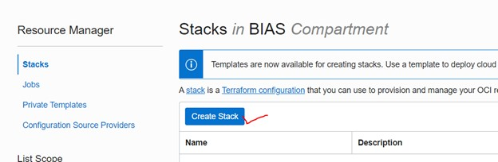

4.  Select **My Configuration**, choose the **.ZIP FILE** button, click the **Browse** link and select the zip file (choose the zip file for Dataflow ETL Load terraform scripts - data\_flow\_ETL\_load.zip) that you downloaded. Click **Select**.

  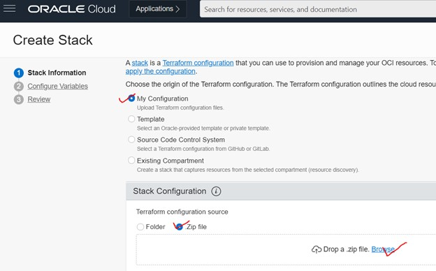

  Click on Browse button and navigate to the path on your computer, where you have downloaded the terraform zip files

  

*Note:* Make sure correct zip file is selected for this Lab it should be ETL load terraform script zip file
  

5. Enter the following information:

      - **Name**:  Enter a name  or keep the prefilled default (*DO NOT ENTER ANY SPECIAL CHARACTERS HERE*, including periods, underscores, exclamation etc, it will mess up the configuration and you will get an error during the apply process)
      - **Description**:  Same as above
      - **Create in compartment**:  Select the correct compartment if not already selected

     ***Note:*** *If this is a newly provisioned tenant such as freetier with no user created compartment, stop here and first create it before proceeding.*

     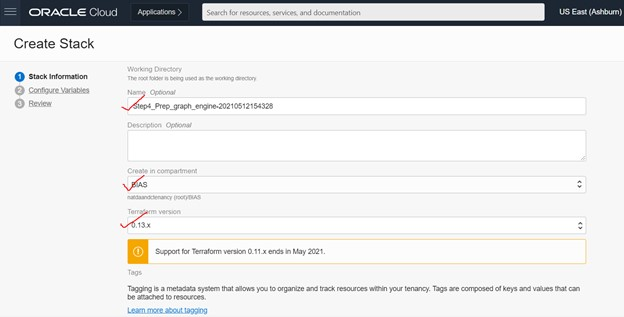

6.  Click **Next**.

  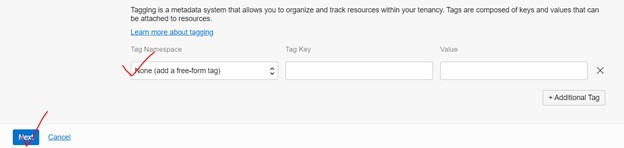

7. Configure the variables used in terraform script:
    - **CompartmentID1:** OCID of the compartment you would like to perform this Lab, make sure you have create resources privileges' in this compartment
    - **CompartmentID2:**  OCID of the compartment you would like to perform this Lab, make sure you have create resources privileges' in this compartment, This is the same OCID that you provided above, for internal purposes we need it to be defined as 2 variables in terraform.
    - **DBIP:** IP address of the database

8. Click **Next**.

9. Review the configurations and click **Create**.

  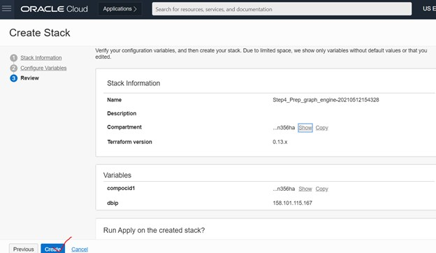

13. Your stack has now been created!  

  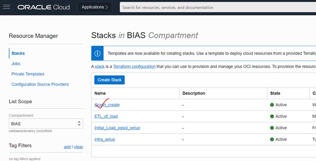

You may now proceed to Next steps

## **STEP 2**: Terraform Plan (OPTIONAL)
When using Resource Manager to deploy an environment, execute a terraform **plan** to verify the configuration. This is optional, *you may skip directly to Step 3*.

1. Choose the ETL Load stack job from list of stack Jobs

  

2.  **[OPTIONAL]** Click **Terraform Actions** -> **Plan** to validate your configuration.  This takes about a minute, please be patient.

  

  Optionally give name for the plan

  

  Look at the Logs section in the screen

  

  You can expand and scroll down to the logs to see the progress and any ERRORS

  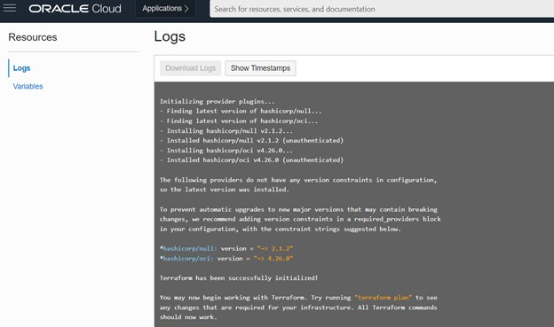

  Make sure Plan succeed and RM icon turns green in the left corner

  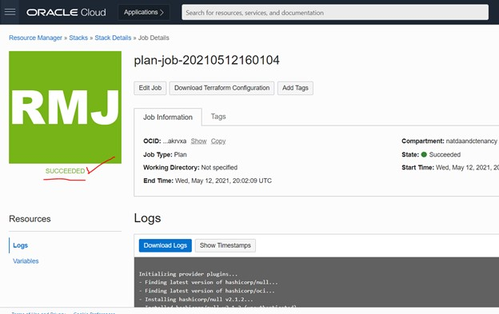

## **STEP 3**: Terraform Apply
When using Resource Manager to deploy an environment, execute a terraform **apply** to actually create the configuration.  Let's do that now.

1.  At the top of your page, click on **Stack Details**.  click the button, **Terraform Actions** -> **Apply**.

  

*Note:* Please monitor the apply operation and the stack job executed successfully after you performed apply action

## **STEP 4**: Validate the data is Loaded using sqlDeveloper tool

1. Connect to Database instance as directed in Lab1 Step2

2. Execute below queries to validate the database

  select count(*) from poc.CUST\_TRANSACTION_DWH

  this query should return you the count

  

  Similarly run all the following queries to verify the data load from previous dataflow Jobs

  select count(*) from POC.CUSTOMER_DWH

  select count(*) from POC.SOCIAL\_MEDIA\_DWH

  select count(*) from VERTEX\_TABLE

  select count(*) from EDGE\_TABLE

## Appendix:  Terraform and Resource Manager
Terraform is a tool for building, changing, and versioning infrastructure safely and efficiently.  Configuration files describe to Terraform the components needed to run a single application or your entire datacenter.  In this lab a configuration file has been created for you to build network and compute components.  The compute component you will build creates an image out of Oracle's Cloud Marketplace.  This image is running Oracle Linux 7.

Resource Manager is an Oracle Cloud Infrastructure service that allows you to automate the process of provisioning your Oracle Cloud Infrastructure resources. Using Terraform, Resource Manager helps you install, configure, and manage resources through the "infrastructure-as-code" model. To learn more about OCI Resource Manager, take a watch the video below.

### Oracle Cloud Marketplace
The Oracle Cloud Marketplace is a catalog of solutions that extends Oracle Cloud services.  It offers multiple consumption modes and deployment modes.  In this lab we will be deploying the free Oracle Enterprise Manager 13c Workshop marketplace image.

[Link to OCI Marketplace](https://www.oracle.com/cloud/marketplace/)

## Appendix: Troubleshooting Tips
If you encountered any issues during the lab, follow the steps below to resolve them.  If you are unable to resolve, please skip to the **Need Help** section to submit your issue via our  support forum.
- Availability Domain Mismatch
- Limits Exceeded
- Invalid public key
- Flex Shape Not Found

### Issue 1: Availability Domain Mismatch
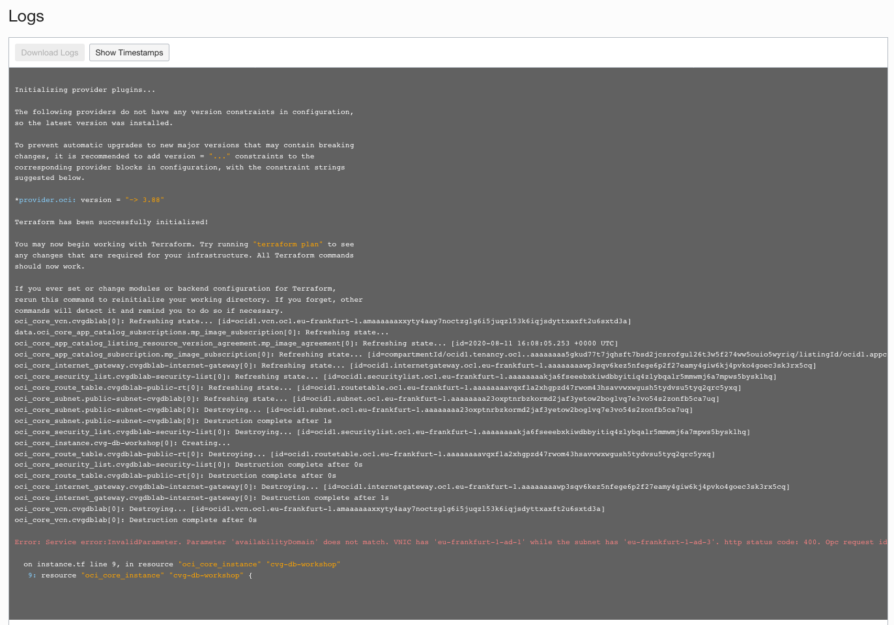

#### Issue #1 Description
When creating a stack and using an existing VCN, the availability domain and the subnet must match otherwise the stack errors.  

#### Fix for Issue #1
1.  Click on **Stack**-> **Edit Stack** -> **Configure Variables**.
2.  Scroll down to the network definition.
3.  Make sure the Availability Domain number matches the subnet number.  E.g. If you choose AD-1, you must also choose subnet #1.
4.  Click **Next**
5.  Click **Save Changes**
6.  Click **Terraform Actions** -> **Apply**

### Issue 2: Invalid public key
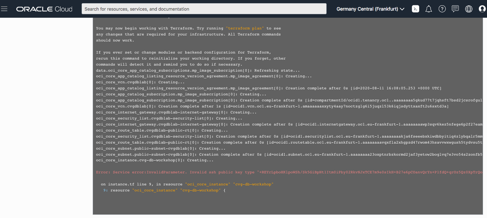

#### Issue #2 Description
When creating your SSH Key, if the key is invalid the compute instance stack creation will throw an error.

#### Tips for fixing for Issue #2
- Go back to the instructions and ensure you create and **copy/paste** your key into the stack correctly.
- Copying keys from Cloud Shell may put the key string on two lines.  Make sure you remove the hard return and ensure the key is all one line.
- Ensure you pasted the *.pub file into the window.
1.  Click on **Stack**-> **Edit Stack** -> **Configure Variables**.
2.  Repaste the correctly formatted key
3.  Click **Next**
4.  Click **Save Changes**
5.  Click **Terraform Actions** -> **Apply**

### Issue 3: Flex Shape Not Found
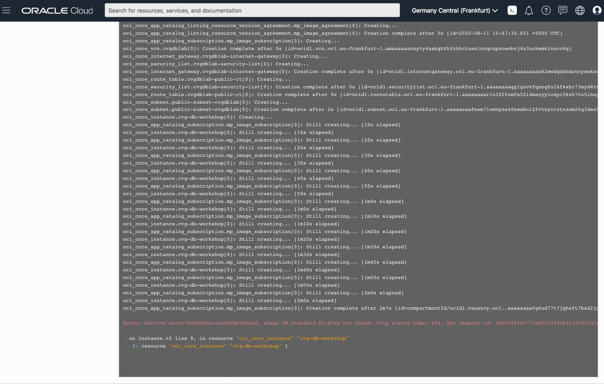

#### Issue #3 Description
When creating a stack your ability to create an instance is based on the capacity you have available for your tenancy.

#### Fix for Issue #3
If you have other compute instances you are not using, you can go to those instances and delete them.  If you are using them, follow the instructions to check your available usage and adjust your variables.
1. Click on the Hamburger menu, go to **Governance** -> **Limits, Quotas and Usage**
2. Select **Compute**
3. These labs use the following compute types.  Check your limit, your usage and the amount you have available in each availability domain (click Scope to change Availability Domain)
4. Look for Standard.E2, Standard.E3.Flex and Standard2
4.  Click on the hamburger menu -> **Resource Manager** -> **Stacks**
5.  Click on the stack you created previously
6.  Click **Edit Stack** -> **Configure Variables**.
7.  Scroll down to Options
8.  Change the shape based on the availability you have in your system
9.  Click **Next**
10. Click **Save Changes**
11. Click **Terraform Actions** -> **Apply**

### Issue 4: Limits Exceeded
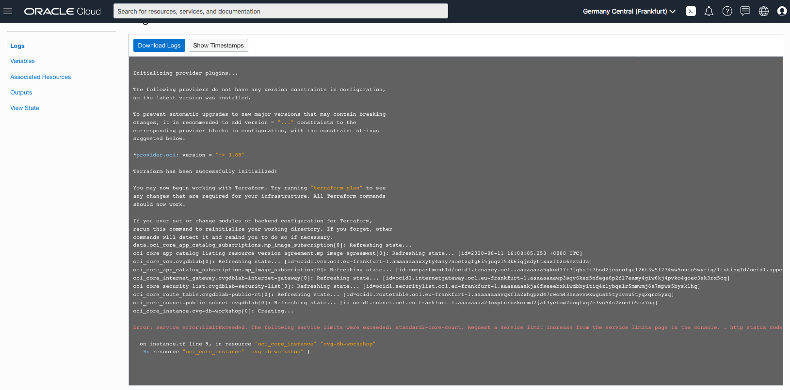

#### Issue #4 Description
When creating a stack your ability to create an instance is based on the capacity you have available for your tenancy.

*Please ensure that you are NOT running this in the **Always Free** Tier. This workshop does not run on the Always Free tier, you must have available cloud credits.  Go to **Governance** -> **Limits, Quotas and Usage,** select **compute**, ensure that you have **more than** the micro tier available.  If you have only 2 micro computes, your account has transitioned to an Always Free.  This means that the promotional period of 30 days has expired or you have run out of credits, this workshop will NOT run.*

#### Fix for Issue #4
If you have other compute instances you are not using, you can go to those instances and delete them.  If you are using them, follow the instructions to check your available usage and adjust your variables.

1. Click on the Hamburger menu, go to **Governance** -> **Limits, Quotas and Usage**
2. Select **Compute**
3. These labs use the following compute types.  Check your limit, your usage and the amount you have available in each availability domain (click Scope to change Availability Domain)
4. Look for Standard.E2, Standard.E3.Flex and Standard2
5. This workshop requires at least 4 OCPU and a minimum of 30GB of memory.  If you do not have that available you may request a service limit increase at the top of this screen.  If you have located capacity, please continue to the next step.
6.  Click on the Hamburger menu -> **Resource Manager** -> **Stacks**
7.  Click on the stack you created previously
8.  Click **Edit Stack** -> **Configure Variables**.
9.  Scroll down to Options
10. Change the shape based on the availability you have in your system
11. Click **Next**
12. Click **Save Changes**
13. Click **Terraform Actions** -> **Apply**

## Acknowledgements

* **Author** - Sandeep Keni Senior Principal Consultant and Hasan Dange Principal Consultant, BIAS corp
* **Contributors** - Kay Malcolm, Product Manager, Database Product Management
* **Last Updated By/Date** - Kay Malcolm, Product Manager, Database Product Management, September 2020

## Need Help?
Please submit feedback or ask for help using our [LiveLabs Support Forum](https://community.oracle.com/tech/developers/categories/livelabsdiscussions). Please click the **Log In** button and login using your Oracle Account. Click the **Ask A Question** button to the left to start a *New Discussion* or *Ask a Question*.  Please include your workshop name and lab name.  You can also include screenshots and attach files.  Engage directly with the author of the workshop.

If you do not have an Oracle Account, click [here](https://profile.oracle.com/myprofile/account/create-account.jspx) to create one.
